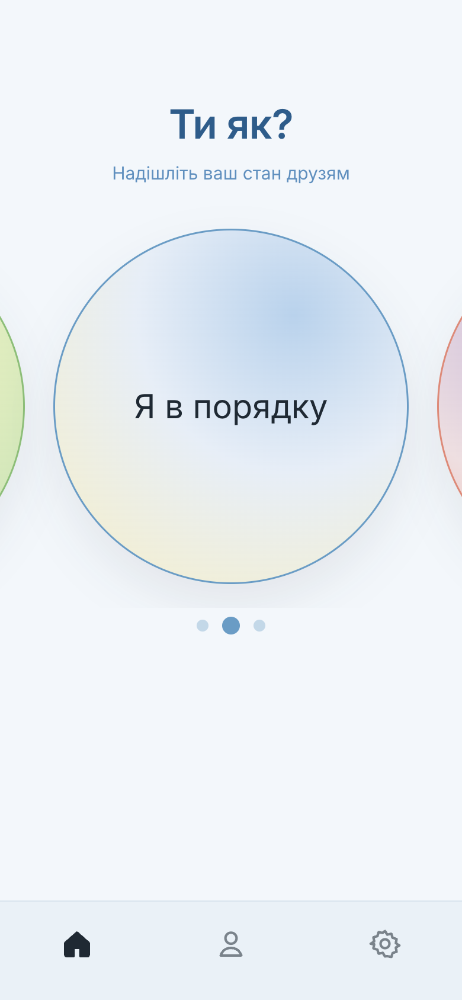
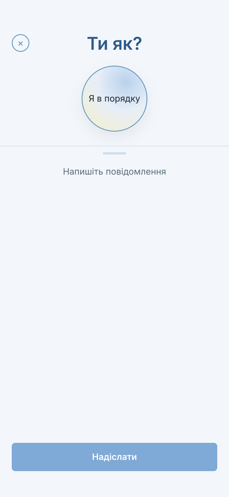
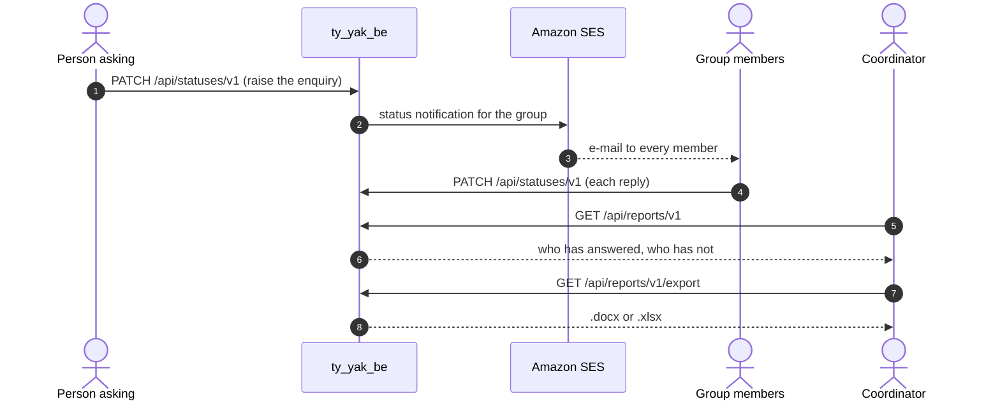

# ty_yak_be

Backend for an emergency check-in service. When something happens, an air raid, a power cut, a
disaster, one person asks the people who matter to them whether they are safe, and each of
them answers. "Ти як?" is Ukrainian for "how are you".

The web client is [ty_yak_fe](https://github.com/konstde00/ty_yak_fe).

| Home | Compose | Following |
|---|---|---|
|  |  |  |

## How a check-in runs



## What it does

**Circles.** Every subscriber belongs to one or more groups: a family, a team, the residents
of a building. Groups are administered over REST, members join by invitation, and a roster can
be imported in bulk from a Word or Excel file so that an organisation can be enrolled from a
list it already holds.

**The enquiry and the reply.** When a status is raised, everyone in the affected group is
notified by electronic mail through Amazon SES, with device tokens registered for push
delivery. Each person replies by setting their own status, which is recorded against them and
made available to the group.

**Records.** Reports establish who has been responding and how recently, are generated on
request and are exported as `.docx` or `.xlsx`, so that a coordinator can account for the
group in a form that can be filed or forwarded.

**Accounts.** Registration and authentication, including Google sign-in, JSON Web Token issue
and refresh, roles, confirmation codes by electronic mail, profile images held in S3, and
subscription and payment records.

## HTTP surface

| Area | Endpoints |
|---|---|
| Sign-in | `POST /api/v1/login/email`, `POST /api/v1/login/google`, `POST /api/v1/token/refresh`, `POST /api/v1/logout` |
| Accounts | `POST /api/users/v1/registration/email`, `POST /api/users/v1/registration/google`, `POST /api/users/v1/check/username`, `GET /api/users/v1/info`, `DELETE /api/users/v1` |
| Credentials | `PUT /api/users/v1/password/change`, `PUT /api/users/v1/password/recovery`, `POST /api/users/v1/email-code/confirm` |
| Profile and devices | `POST /api/users/v1/avatar`, `DELETE /api/users/v1/avatar`, `PUT /api/users/v1/device-token`, `PUT /api/users/v1/device-token/reset` |
| Roster import | `POST /api/users/v1/upload` (Word or Excel) |
| Groups and statuses | `PUT /api/groups/v1`, `PATCH /api/statuses/v1` |
| Reports | `GET /api/reports/v1`, `GET /api/reports/v1/export` |

Interactive documentation is served at `/swagger-ui.html`.

## How it is organized

| Module | Responsibility |
|---|---|
| `social` | groups, statuses, and the notification that carries the enquiry to a group |
| `auth` | subscribers, authentication, tokens, roster import and file storage |
| `reports` | report generation and the export writers |
| `application` | entry point, web and security configuration, and the database schema |

Java 17, Spring Boot, PostgreSQL. The schema is governed by Liquibase, thirteen tables with
their constraints, versioned alongside the code.

## Running

Requires a JDK (17 or later), Maven and Docker. Configuration is supplied through the
environment, with local defaults that match the database service in the Compose file.

```bash
docker compose -f docker/docker-compose.yml up -d postgresql   # PostgreSQL on localhost:5432
mvn -q -DskipTests install                                     # builds and installs all four modules
mvn spring-boot:run -pl application                            # starts the service on port 8080
```

Liquibase applies the schema on the first start. The mail and file paths reach Amazon SES and
S3 and take their credentials from the environment.

## Shipping

The container image is produced from the `Dockerfile`, with a Google Jib build configured as
an alternative, and `.gitlab-ci.yml` builds the image, publishes it to Amazon ECR and deploys
it over SSH.

## Where it sits

This service applies a modular decomposition first worked out in
[demo-uni](https://github.com/konstde00/demo-uni), where each faculty owned its own domain.
The same question, how far a system should go in giving each party its own data, is taken up
in [multitenancy_overview](https://github.com/konstde00/multitenancy_overview), where every
tenant is given a database of its own, and in
[runtime-tenant-onboarding](https://github.com/konstde00/runtime-tenant-onboarding), the
current implementation.

## License

Apache-2.0. See [LICENSE](LICENSE).
